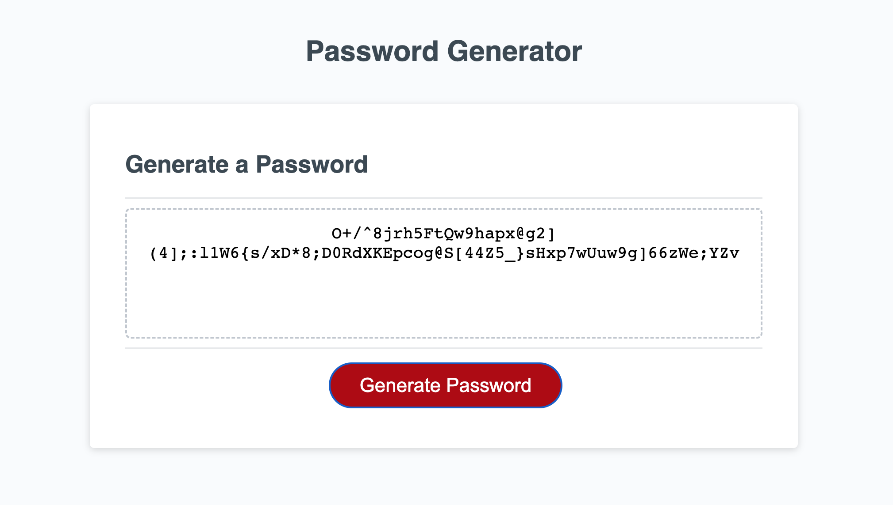

# Password Generator: JavaScript

## Description

Added JS code to HTML and CSS files to give the password generator functionality. Method included;

-- Querry selectors
-- If statements
-- confirm methods
-- Math.random method
-- eventlistener

## Objectives

To create a randomized password generator with 8-128 characters. Password criteria is selectable using a series of prompts and includes; upper and lower case letters, numbers, and symbols.

### Links

**GitHub Repository**
https://github.com/Widewanderer/Password_Generator-3

**Password Generator Website**
https://widewanderer.github.io/Password_Generator-3/

### Screenshots

)

